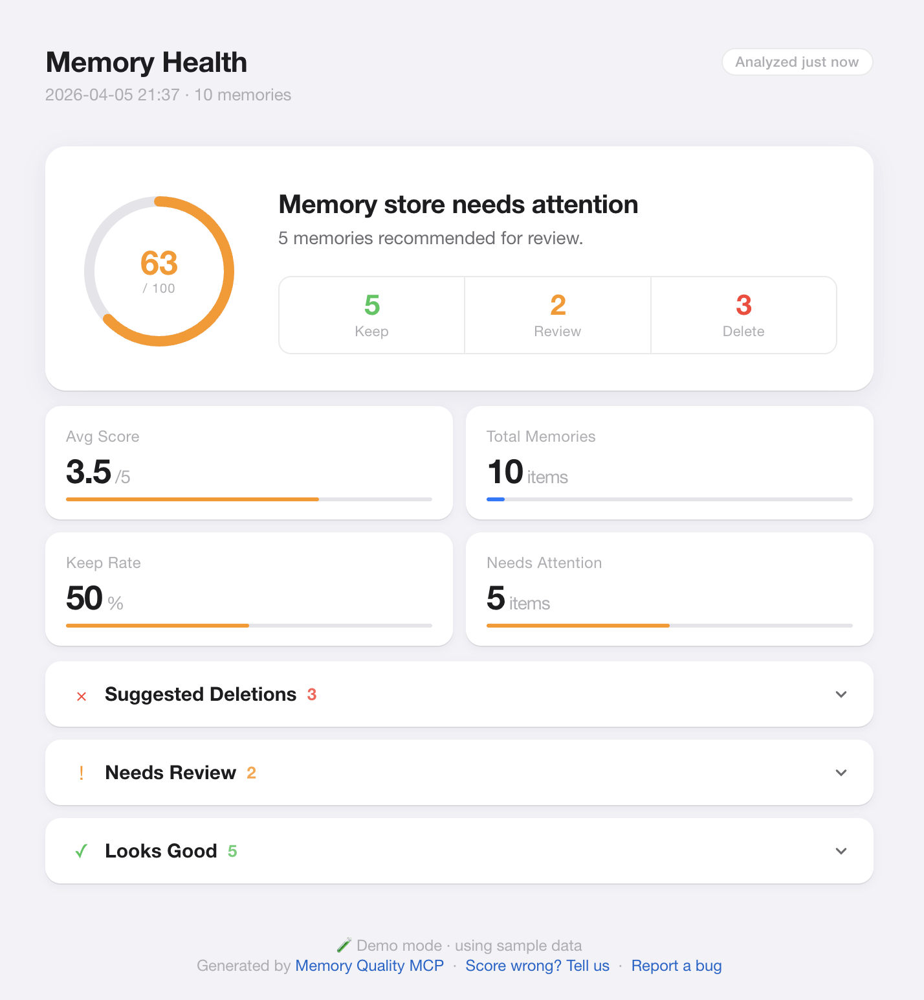
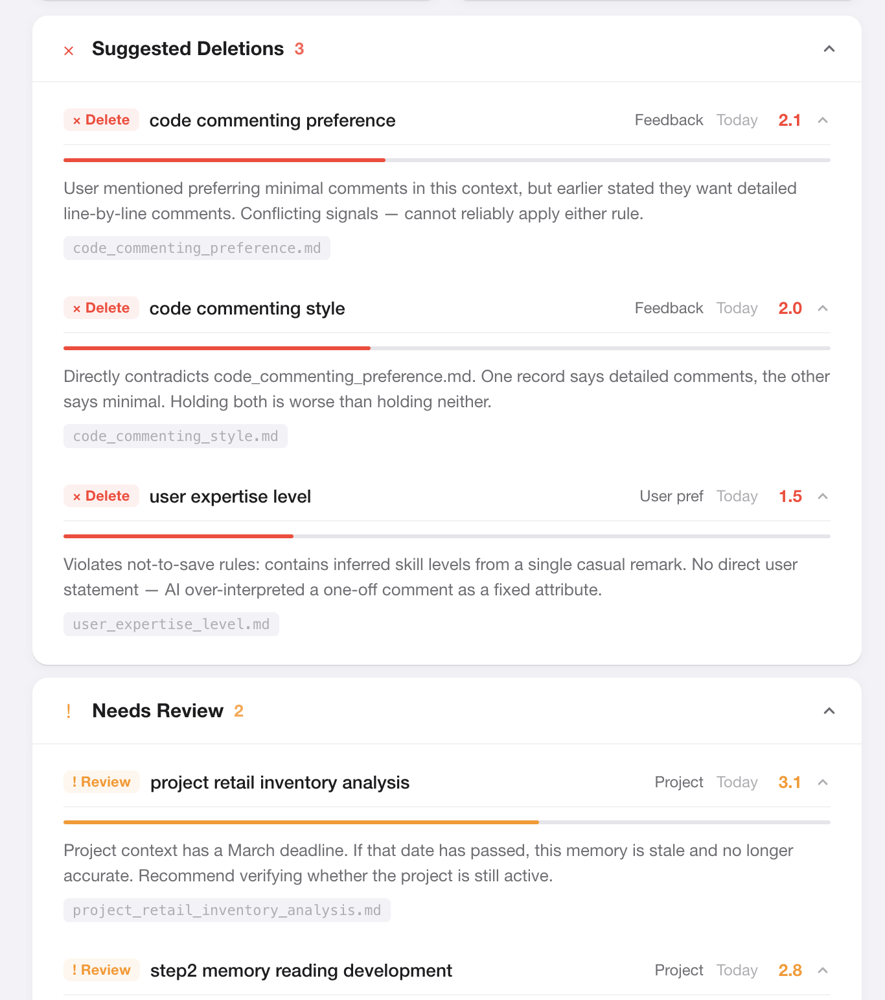

# Memory Quality MCP

**A Claude Code MCP plugin that audits and cleans up your AI memory.**

[中文版](README_CN.md) · [Report a Bug](https://github.com/ladyiceberg/memory-quality-mcp/issues/new?template=bug_report.md) · [Request a Feature](https://github.com/ladyiceberg/memory-quality-mcp/issues/new?template=feature_request.md)

---



---

Claude Code v2.1.59+ automatically saves memories from your conversations. Over time, your memory store accumulates:

- **Stale memories** — "working on Project X this week" from months ago
- **Junk memories** — offhand remarks treated as permanent facts
- **Conflicting memories** — "prefers detailed comments" and "keep code clean and minimal" coexisting
- **Misrecorded memories** — AI over-interpreted a one-time comment as a fixed habit

This plugin audits your memory store with a 4-dimension quality score (Importance / Recency / Credibility / Accuracy) and gives you actionable cleanup recommendations — with a visual dashboard.

---

## Requirements

- **Claude Code v2.1.59+** (run `claude --version` to check)
- **Python 3.10+**
- **LLM API Key** — OpenAI, Kimi, MiniMax, or Anthropic (any one will do)

---

## Installation

### Option 1: uvx (recommended — no manual install)

Add to your Claude Code MCP config (`~/.claude/settings.json` or your project's `.claude/settings.json`):

```json
{
  "mcpServers": {
    "memory-quality": {
      "command": "uvx",
      "args": ["memory-quality-mcp"],
      "env": {
        "OPENAI_API_KEY": "your-key-here"
      }
    }
  }
}
```

### Option 2: pip

```bash
pip install memory-quality-mcp
```

Then in your MCP config:

```json
{
  "mcpServers": {
    "memory-quality": {
      "command": "memory-quality-mcp",
      "env": {
        "MINIMAX_API_KEY": "your-key-here"
      }
    }
  }
}
```

---

## Configure your LLM

Set **one** of these environment variables in the `env` field above:

| Provider | Env Variable | Default Model |
|----------|-------------|---------------|
| OpenAI | `OPENAI_API_KEY` | gpt-4o-mini |
| Kimi | `KIMI_API_KEY` | moonshot-v1-8k |
| MiniMax | `MINIMAX_API_KEY` | MiniMax-M2.5 |
| Anthropic | `ANTHROPIC_API_KEY` | claude-haiku-4-5 |

The plugin auto-detects which provider to use based on whichever key is set.

For advanced config (custom model, thresholds), edit `~/.memory-quality-mcp/config.yaml` — generated automatically on first run.

---

## Usage

After setup, restart Claude Code and talk to it naturally:

### 1. Try the demo first (no memories needed)

```
Open the memory dashboard in demo mode
```

Claude calls `memory_dashboard(demo=True)` → opens a browser page with example data so you can see what the tool does before running it on your real memories.

### 2. Quick health check (no LLM cost)

```
Check my memory store health
```

Returns: total memories across all projects, stale count, index usage, estimated LLM calls for a full report.

### 3. Full quality analysis

```
Run a detailed memory quality analysis
```

Scores every memory on 4 dimensions, detects conflicts, flags rule violations. Results are cached — cleanup and dashboard reuse them without calling the LLM again.

> Cost estimate: ~8–9 LLM calls for 50 memories (~$0.01 with gpt-4o-mini)

### 4. Open visual dashboard

```
Open the memory health dashboard
```

Opens a local HTML page in your browser:

- Health score ring (0–100)
- Summary stats (kept / review / delete)
- Collapsible memory list — click any item to expand score details



### 5. Clean up

```
Clean up the memories marked for deletion
```

Claude previews with `memory_cleanup(dry_run=True)` first, then executes on confirmation.

**Safety guarantees:**
- Preview before every deletion
- Auto-backup to `.trash/<timestamp>/` before deleting
- Never silent-deletes anything

### 6. Score a single memory (debug)

```
Score this memory: "User always codes late at night"
```

### 7. Analyze a specific project

```
Analyze memories for ~/my-project only
```

---

## How scoring works

| Dimension | Weight | What it measures |
|-----------|--------|-----------------|
| Importance | 40% | How useful is this for future conversations? |
| Recency | 25% | Is this information still accurate? |
| Credibility | 15% | Is there a clear source (user stated it explicitly)? |
| Accuracy | 20% | Did the AI record it faithfully, without over-interpreting? |

Score > 3.5 → Keep ｜ 2.5–3.5 → Review ｜ < 2.5 → Delete

---

## Typical workflow

```
You: Check my memory health

Claude: [memory_audit()]
        47 memories across 3 projects
        - Possibly stale: 8
        - Project memories past threshold: 3
        - MEMORY.md usage: 23% (46/200 lines)
        Estimated ~9 LLM calls for a full report.

You: Run the full analysis

Claude: [memory_report()]
        47 memories | 🗑 delete 8 | 🔄 review 5 | ✅ keep 34

        ⚡ 1 conflict found
        - 🔴 feedback_comments_a.md × feedback_comments_b.md
          One says "detailed comments", the other says "minimal comments"

        🗑 Suggested deletions (8)
        - project_q1_plan.md [project] · 120 days ago
          Score 1.5 · project memory past 90-day threshold

        Report cached — cleanup won't need to re-analyze

You: Open the dashboard

Claude: [memory_dashboard()]
        ✅ Dashboard opened in browser

You: Clean those up

Claude: [memory_cleanup(dry_run=True)]
        🔍 Preview (nothing deleted yet)
        8 memories will be removed: project_q1_plan.md ...

You: Confirm

Claude: [memory_cleanup(dry_run=False)]
        ✅ Cleaned up 8 memories
        Backup: ~/.claude/.../memory/.trash/20260405_143022/
        MEMORY.md index updated
```

---

## FAQ

**Q: "No memory files found"**

Requires Claude Code v2.1.59+. Check:
```bash
claude --version              # must be >= v2.1.59
ls ~/.claude/projects/        # should list your projects
```

If the version is new enough but no files exist yet, Claude hasn't decided anything is worth remembering yet. Keep using Claude Code normally — files will appear within a few sessions.

Want to see the tool in action first? Run `memory_dashboard(demo=True)`.

**Q: Are the scores accurate?**

Scores are suggestions, not commands. You make the final call. Every deletion requires confirmation and is backed up. If you find consistent scoring errors, please [open a Wrong Score issue](https://github.com/ladyiceberg/memory-quality-mcp/issues/new?template=wrong_score.md) — each report directly improves the model.

**Q: Which LLMs are supported?**

Any OpenAI-compatible API. Built-in presets: OpenAI, Kimi, MiniMax, Anthropic. Custom providers via `MEMORY_QUALITY_BASE_URL` environment variable.

**Q: Will it delete something important?**

No. Every operation: ① shows a preview ② requires explicit confirmation ③ auto-backs up to `.trash/` before deleting.

**Q: Where are my memory files?**

```bash
ls ~/.claude/projects/*/memory/
```

Or type `/memory` inside Claude Code to browse and edit them directly.

---

## Contributing

Found a scoring error? [Tell us](https://github.com/ladyiceberg/memory-quality-mcp/issues/new?template=wrong_score.md) — your feedback directly calibrates the model.

Bug or feature idea? [Open an issue](https://github.com/ladyiceberg/memory-quality-mcp/issues).

---

## License

MIT
